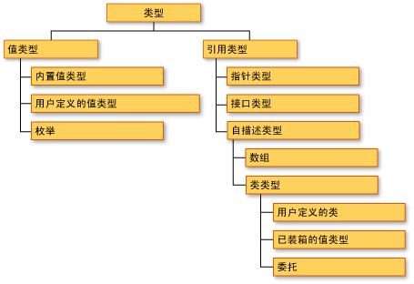

访问博客[C#/.NET Web 部分复习总结（面试常问）](https://ns96.com/2018/01/19/Csharp-knowledgere/) 带目录模式查看！

# **C#**

## 值类型和引用类型的区别?
在C#中值类型的变量直接存储数据，而引用类型的变量持有的是数据的引用，数据存储在数据堆中。


>值类型（value type）：byte，short，int，long，float，double，decimal，char，bool 和 struct 统称为值类型。值类型变量声明后，不管是否已经赋值，编译器为其分配内存。  

>引用类型（reference type）：string 和 class统称为引用类型。当声明一个类时，只在栈中分配一小片内存用于容纳一个地址，而此时并没有为其分配堆上的内存空间。当使用 new 创建一个类的实例时，分配堆上的空间，并把堆上空间的地址保存到栈上分配的小片空间中。  


值类型的实例通常是在线程栈上分配的（静态分配），但是在某些情形下可以存储在堆中。引用类型的对象总是在进程堆中分配（动态分配）。  


**总结一句话**：c#的值类型是为变量在栈上分配了一块内存，用于存储数据，而引用类型分为两部分，声明时只在栈上分配了一小部分内存，堆上没分配，而new引用变量时，是在堆上分配了一块内存，存储的是栈上的内存地址，注意：struct是值类型，string和class是引用类型，string不需要new是因为想要语义化“字符串”,省略创建过程。  





## C# 递归是什么？
在数学与计算机科学中，递归是指在函数的定义中使用函数自身的方法。

递归算法是一种直接或者间接地调用自身算法的过程。在计算机编写程序中，递归算法对解决一大类问题是十分有效的，它往往使算法的描述简洁而且易于理解。

递归算法解决问题的特点：
-  递归就是在过程或函数里调用自身。
- 在使用递归策略时，必须有一个明确的递归结束条件，称为递归出口。
- 递归算法解题通常显得很简洁，但递归算法解题的运行效率较低。所以一般不提倡用递归算法设计程序。
- 在递归调用的过程当中系统为每一层的返回点、局部量等开辟了栈来存储。递归次数过多容易造成栈溢出等。所以一般不提倡用递归算法设计程序。在实际编程中尤其要注意栈溢出问题。


借助递归方法，我们可以把一个相对复杂的问题转化为一个与原问题相似的规模较小的问题来求解，递归方法只需少量的程序就可描述出解题过程所需要的多次重复计算，大大地减少了程序的代码量。但在带来便捷的同时，也会有一些缺点，也即：通常用递归方法的运行效率不高。

**简言之：** 递归就是一个可以自我调用的函数或则方法。

---

**以Fibonacci数列和阶乘为例：**

## Fibonacci
>斐波那契数列就是如下的数列：0, 1, 1, 2, 3, 5, 8, 13, 21, 34, 55, 89, 144, …
总之，就是第N(N > 2)个数等于第(N - 1)个数和(N - 2)个数的和。

```cs
public static int Fibonacci(int n)
{
    if (n < 0) return -1;
    if (n == 0) return 0;
    if (n == 1) return 1;
    return Fibonacci(n - 1) + Fibonacci(n - 2);
}
```

## 阶乘
>阶乘公式： n!=1×2×3×...×n

```cs
public static int Factorial(int n)
{
    int sum = 0;
    if(0 == n)
        return 1;
    else
        sum = n * Factorial(n -1);
    return sum;
}
```

## 委托
先说下什么是委托，顾名思义，就是自己不完成，让别人帮你完成！

换成大白话：我遇到了一个问题，我不知道怎么解决，但是我接下来要做的事情需要这个问题的结果作为前提，我就去找一个人来帮我得出结论，岂不美哉。

在C#中，委托的作用是这样描述的：委托就像一个函数的指针，在程序运行时可以使用它们来调用不同的函数。

### 简单的委托

那委托需要承载哪些信息呢？

首先，它存储了方法名，还有参数列表(方法签名),以及返回的类型。比如：

```
delegate string/*返回类型*/ ProcessDelegate(int i);
```

这就是一个委托的定义。`delegate` 是声明委托的关键字，`string` 是返回的类型，而`ProcessDelegate(int i)`是委托的类型名，和一个类名差不多，而`()`里的就是参数部分。

翻译一下，你要使用这个委托来做事情的话，那么，做事情的方法必须满足以下条件：

1. 返回类型和委托的返回类型一致，这里是string类型；
2. 能且只能有一个参数，并且是int类型。

示例：
```cs
using System;
using System.Collections.Generic;
using System.Text;
 
namespace TestApp
{
    public delegate string ProcessDelegate(string s1, string s2);

    class Program
    {
        static void Main(string[] args)
        {
            /*  调用方法  */
           ProcessDelegate pd = new ProcessDelegate(new Test().Process);
           Console.WriteLine(pd("Text1", "Text2"));
        }
    }
 
    public class Test
    {
        public string Process(string s1,string s2)
        {
             return s1 + s2;
        }
    }
}
```
>输出的结果是: Text1Tex2


## 什么是装箱和拆箱？

--- 

# **ASP.NET**

## 静态网页和动态网页的执行过程及其异同 
**静态网页**：在网站设计中，纯粹HTML 格式的网页通常被称为“静态网页”。 

其执行过程如下：  
- 用户在客户端将HTML文件的网址输入到浏览器的地址栏，请求一个HTML网页。 
- Web浏览器向Web服务器发送HTML文件请求，称为Request（请求）。  
- Web服务器找到该HTML文件，将其传送给用户浏览器，称为Response（响应）。
- 用户的Web浏览器解释HTML文件，结果在Web浏览器中显示。   
 
**动态网页**：是采用ASP、ASP.NET、JSP或PHP等语言动态生成的网页，在接到用户访请求后生成网页并传输到用户的浏览器。 

其执行过程如下： 
- 用户在客户端将一个网址输入到浏览器的地址栏，请求一个Web网页。
- Web浏览器向Web服务器发送Web网页请求，称为Request（请求）。
- Web服务器找到该ASP.NET文件对其进行解释并生成标准的HTML文件。
- Web浏览器将HTML文件传送给用户浏览器，称为Response（响应）。 用户的Web浏览器解释HTML文件，结果在Web浏览器中显示。

## 如和让 JavaScript 按 ID 访问 ASP.NET 控件

从客户端脚本访问控件的一种方法是将服务器控件的 ClientID 属性值传递给 document.getElementById 方法。 ClientID 属性值在 HTML 中以 id 特性的形式呈现。

```cs
<%@ Control AutoEventWireup="true" %>

<script type="text/javascript">
  var seasonalSports = new Array("None selected",
                                 "Tennis",
                                 "Volleyball",
                                 "Baseball",
                                 "Skiing");

  function DisplaySport(x) {
      document.getElementById("SelectedSport").innerHTML
      = seasonalSports[x];
  }    
</script>

<asp:DropDownList ID="DropDownList1" runat="server" 
                  onchange="DisplaySport(this.selectedIndex);">
  <asp:ListItem Value="Select a season"></asp:ListItem>
  <asp:ListItem Value="Spring"></asp:ListItem>
  <asp:ListItem Value="Summer"></asp:ListItem>
  <asp:ListItem Value="Autumn"></asp:ListItem>
  <asp:ListItem Value="Winter"></asp:ListItem>
</asp:DropDownList>
<br />
<asp:Label ID="SelectedSport" runat="server" ClientIDMode="Static">
</asp:Label>
```

参考[MSDN](https://msdn.microsoft.com/zh-cn/library/dd410598%28v=vs.100%29.aspx?f=255&MSPPError=-2147217396)

---

# **ADO.NET**
## ADO.NET中读写数据库需要用到哪些类?他们的作用?
>ADO.NET是微软新一代.NET数据库的访问架构，ADO是ActiveX Data Objects的缩写。ADO.NET是数据库应用程序和数据源之间沟通的桥梁，主要提供一个面向对象的数据访问架构，用来开发数据库应用程序。  

  


  
 .NET Framework 数据提供程序的四个核心对象:  
  
|对象|说明|
|:--:|:--|
|Connection|建立与特定数据源的连接。 所有 Connection 对象的基类均为 DbConnection 类。|
|Command|对数据源执行命令。 公开 Parameters，并可在 Transaction 范围内从 Connection 执行。 所有 Command 对象的基类均为 DbCommand 类。|
|DataReader|从数据源中读取只进且只读的数据流。 所有 DataReader 对象的基类均为 DbDataReader 类。|
|DataAdapter|使用数据源填充 DataSet 并解决更新。 所有 DataAdapter 对象的基类均为 DbDataAdapter 类。|
  

---
**如何理解其关系**：通俗来说，可以这样理解——`Connection` 建立与数据源的链接，然后使用 `Command` 来对数据源进行 `CRUD` 的操作， `DataReader` 则是一个用于读取数据信息的工具 ，最终通过 `DataAdapter` 将数据填入 DataSet 数据集，最终展现出来。  
  

**实际项目中**：在实际项目中，通常先将数据库的连接池写入 config 中，然后再项目中引用 config 设置，同时配置号 SqlHelper 类来方便数据的 CRUD 操作。  


