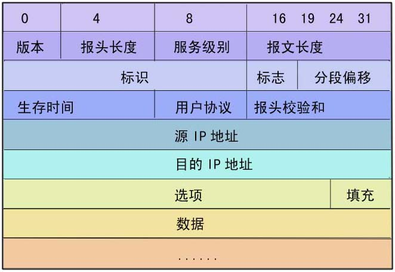

# 概述

>TCP/IP不是一个协议，而是一个协议族的统称。里面包括了IP协议，IMCP协议，TCP协议，以及我们更加熟悉的http、ftp、pop3协议等等。电脑有了这些，就好像学会了外语一样，就可以和其他的计算机终端做自由的交流了。

实质上，TCP/IP协议族的结构与ISO-OSI的七层协议经典架构稍有不同,通常来讲，我们将之分为四层或者五层。分别是：

- 链路层：处理与电缆（或）其他任何传输媒介的物理接口细节  *设备驱动程序及接口卡*
- 网络层：处理分组在网络中的活动，例如分组选路  *IP/ICMP/IGMP*
- 运输层：为两台主机上的应用程序提供端到端的通讯  *TCP和UDP*
- 应用层：处理特定的应用程序细节  *Telnet FTP 和e-mail等*

## 补充一些基础知识

### 互联网地址(ip地址)

网络上每一个节点都必须有一个独立的Internet地址（也叫做[IP地址](https://www.wikiwand.com/zh-hans/IP%E5%9C%B0%E5%9D%80)）。现在，通常使用的IP地址是一个32bit的数字，也就是我们常说的IPv4标准，这32bit的数字分成四组，也就是常见的255.255.255.255的样式。IPv4标准上，地址被分为[五类](https://www.wikiwand.com/zh-hans/%E5%88%86%E7%B1%BB%E7%BD%91%E7%BB%9C)，我们常用的是B类地址。具体的分类请参考其他文档。需要注意的是IP地址是网络号+主机号的组合，这非常重要。

### 域名系统

域名系统是一个分布的数据库，它提供将主机名（就是网址啦）转换成IP地址的服务。

### RFC

RFC是什么？RFC就是tcp/ip协议的标准文档，在这里我们可以看到RFC那长长的定义列表，现在它一共有4000多个协议的定义，当然，我们所要学习的，也就是那么十几个协议而已。
- [英文目录](http://www.rfc-editor.org/rfc-index.html)
- [中文目录(部分)](http://man.chinaunix.net/develop/rfc/default.htm)

### 端口号(port)

注意，这个号码是用在TCP，UDP上的一个逻辑号码，并不是一个硬件端口，我们平时说把某某端口封掉了，也只是在IP层次把带有这个号码的IP包给过滤掉了而已。

### 应用编程接口

现在常用的编程接口有socket和TLI。而前面的有时候也叫做“Berkeley socket”，可见Berkeley对于网络的发展有多大的贡献。

### MAC地址
MAC地址，即 Media Access Control Address。中文直译为，媒体存取控制地址，通常也称为局域网地址（LAN Address)，以太网地址（Ethernet Address) 或物理地址（Physical Address），它是一个用來确认網路設備位置的位址。

# Link layer - 链路层
通常将链路层称为数据链路层，在TCP/IP协议族中，数据链路层有三个目的：
1. 为IP模块发送和接收IP数据报。
2. 为ARP模块发送ARP请求和接收ARP应答。
3. 为RARP发送RARP请求和接收RARP应答。

先来说下这几个英文简称：
- IP 即 Internet Protocol ，中文为网络协议，IP地址即为网络协议地址的简称。
- ARP 即 Address Resolution Protocol ，中文为地址解析协议，用来通过IP地址定位MAC地址。
- RARP 即 Reverse Address Resolution Protocol，逆地址解析协议。RARP用于将MAC地址转换为IP地址。*其因为较限于IP地址的运用以及其他的一些缺点，因此渐为更新的BOOTP或DHCP所取代。*

TCP/IP 协议族支持的链路层协议很多，列出常用的几个：

## 以太网链路层协议
在win下使用`ipconfig` 和在 Linux下使用 `ifconfig` 均可在返回的信息中找到诸如'以太网适配器'和'eth0'等字段，这就是以太网接口。

>以太网（Ether-net）的定是指数字设备公司（ Digital Equipment Corp.）、英特尔公司（Intel Corp.）和Xerox公司在1982年联合公布的一个标准，这个标准里面使用了一种称作CSMA/CD的接入方法。而IEEE802提供的标准集802.3(还有一部分定义到了802.2中)也提供了一个CSMA/CD的标准。

这两个标准稍有不同，TCP/IP协议对这种情况的处理方式如下:
- 以太网的IP数据报封装在RFC894中定义，而IEEE802网络的IP数据报封装在RFC1042中定义。
- 一台主机一定要能发送和接收RFC894定义的数据报。
- 一台主机可以接收RFC894和RFC1042的封装格式的混合数据报。
- 一台主机也许能够发送RFC1042数据报。如果主机能同时发送两种类型的分组数据，那么发送的分组必须是可以设置的，而且默认条件下必须是RFC 894分组。

以太网协议封装可以参考-[以太网协议封装格式](http://blog.csdn.net/sj349781478/article/details/74058939)

## SLIP（串行线路IP）
>SLIP（Serial Line Internet Protocol，串行线路网际协议），主要在Unix远程访问服务器中使用，现今仍然用于连接某些ISP。因为SLIP协议是面向低速串行线路的，可以用于专用线路，也可以用于拨号线路，Modem的传输速率在1200bps到19200bps。RFC1055中有详细描述。

帧格式的规则：
1. IP数据报以一个被称作END（0xc0）的特殊字符结束。同时为防止数据到来前的噪声，通常在开始处也会传一个END，用来标识数据的起始部分。
2. 若IP报文中某个字符为END，那么要连续传输两个字节0xdb，0xdc来代替。（好比，编程语言中要打印特殊含义的字符的时候要加转义字符）
3. 若IP报文中某个字符为ESC，那么要连续传输两个字节0xdb，0xdd来代替。

SLIP的缺陷：

1. 每一端必须知道对方的IP地址，不能把本端的IP地址通知给另一端

2. 数据帧中没有类型字段。如果一条串行线路用于SLIP，那么它不能同时使用其他协议。
3. SLIP中没有类似于以太网的CRC校验字段，这样纠错能力差。

### CSLIP
传统的串行线路速率较低，为了传输1个字节的数据需要20个字节的IP首部和20个字节的TCP首部。因此，人们提出CSLP（压缩SLIP），他将前面提到的40个字节压缩到3到5个字节，且能够在两端维持多大16个TCP连接，并且知道其中每个连接的首部中的某个字段一般不会发生变化。对于那些发生变化的字段，大多数只是一些小的数字和的改变。被压缩的首部大大缩短了交互响应时间。

## PPP（点对点协议）
PPP协议修改了SLIP协议中的所有缺陷:

包括三个部分：

1. 在串行链路上封装了IP数据报的方法。PPP既支持数据位8为和无奇偶检验的异步模式，还支持面向比特的同步链接。

2. 建立、配置及测试LCP（数据链路的链路控制协议）。它允许通信双方进行协商，以及确定不同的选项。

3. 针对不同网络层协议的NCP（网路控制协议）体系。当前RFC定义的网络层有IP、OSI网络层、DECnet以及AppleTalk。例如，IP NCP允许双方商定是否对报文首部进行压缩，类似于CSLIP

具体参看 - [PPP协议详解](http://blog.csdn.net/bytxl/article/details/50111971)

## 回环接口（127.0.0.1）
回环接口，又叫环回接口都是Loopback Interface的翻译。

关于这个127.0.0.1基本上学过网络编程的人都不会陌生。比如你用C#写一个c/s的程序，要用自己的PC又当Server又当Client。就需要这个回环地址。当然同样可以用localhost代替。

A类网络号就是为了回环接口预留的，大多数系统喜欢分配127.0.0.1，所以在你不装网卡的时候用ping命令也是可以通的。当你把ip数据报传给这个接口的时候，就不能再任何网络上出现了。

对于环回接口，有如下三点值得注意:

- 传给环回地址（一般是127.0.0.1）的任何数据均作为IP输入。
- 传给广播地址或多播地址的数据报复制一份传给环回接口，然后送到以太网上。这是因为- 广播传送和多播传送的定义包含主机本身。
- 任何传给该主机IP地址的数据均送到环回接口。

# IP协议
IP协议是TCP/IP协议的核心，所有TCP，UDP，ICMP,IGMP数据都是以IP数据报的形式传输的，所以IP是TCP/IP协议族中最核心的协议。IP是“不可靠”和“无连接”的协议。

- 不可靠：它不保证IP数据报能成功到达目的地，如果传输过程中发生了错误，那么IP会直接丢弃该数据报，然后发送ICMP消息给信源端。
- 无连接：IP并不维护任何关于后续数据报的状态信息。每个数据报之间相互独立。比如发送两个连续的数据报A和B，由于两者选择的通信的路径的不同可能B比A先到达。

## IP协议头

- **数据**以上是IP首部，一般占20个字节，其中选项是可选的，并不一定存在。数据的二进制最高位在左边记作0bit，最低位在右边记作31bit，这种传递方法被称作“大端法”。

- **版本**标记IP协议的版本，现在常用的是版本4（IPV4）。后面的报头长度（首部长度）很好理解了，普通IP数据报字段值是5。因为首部长度一般是32位。

- **服务级别**通常叫做服务类型（TOS）。TOS字段共有8位，其中3位表示优先权（现在已被忽略），4位分别表示最小时延、最大吞吐量、最高可靠性和最小费用，剩余1位为未用位但必须置0。前面说的那4位只能置其中一位为1，其余为0.如果4位都是0则表示一般服务。

- **生存时间**这个字段规定该数据包在穿过多少个路由之后才会被抛弃(这里就体现出来IP协议包的不可靠性，它不保证数据被送达)，某个ip数据包每穿过一个路由器，该数据包的TTL数值就会减少1，当该数据包的TTL成为零，它就会被自动抛弃。这个字段的最大值也就是255，也就是说一个协议包也就在路由器里面穿行255次就会被抛弃了，根据系统的不同，这个数字也不一样，一般是32或者是64。

- **报文长度**字段是指整个IP数据报的长度，我们根据报头长度和报文长度就能得出数据报中数据内容的起始位置和长度了。由于IP的报文长度字段是16位，所以一个IP数据报的最大长度是65535字节（2的16次方）。但是大多数的链路层都会进一步对IP数据报进行分片，因为主机要求不超过576自己的数据报，尽管有此限制，不过如今的大多数实现（比如网络文件系统NFS）是允许超过8192字节的。

- **标识**字段标识主机发送的每一份数据报，每发送一个其值就会加1。而标识字段和片偏移字段以后在讲分片时我们再讨论。

- **首部检验和字段**计算的是IP的首部，而不是后面的数据（而ICMP、IGMP、UDP和TCP的说不中均含有同时覆盖首部和数据的检验和码）。

## IP路由的选择
由TCP/IP的分层可知，IP转发接收自上层的数据报（TCP、UDP、ICMP、IGMP），或者转发接收自其下层的数据报（网络接口层）。IP层在内存中有一个路由表，每当收到一份数据报的时候，就会检查一次路由表。IP会检查收到的数据报目的IP地址是否为本机的IP地址之一（或本机广播IP地址）。如果是的话，就证明是发送给本机的，那么IP层就会根据数据报的IP首部的协议字段，来将其装发给上层的对应协议来处理。而如果目的IP不是本机的话，IP会做出两种选择：（1）IP层被设置为路由器，将数据报转发出去。（2）丢弃该数据报。

最特殊的情况是目的主机和主机直连，那么主机根本不用寻找路由，直接把数据传递过去就可以了。

稍微一般一点的情况是，主机通过若干个路由器(router)和目的主机连接。路由器就要通过ip包的信息来为ip包寻找到一个合适的目标来进行传递，比如合适的主机，或者合适的路由。路由器或者主机将会用如下的方式来处理某一个IP数据包。

1. 如果IP数据包的TTL（生命周期）已到，则该IP数据包就被抛弃。

2. 搜索路由表，优先搜索匹配主机，如果能找到和IP地址完全一致的目标主机，则将该包发向目标主机。

3. 搜索路由表，如果匹配主机失败，则匹配同子网的路由器，这需要“子网掩码(1.3.)”的协助。如果找到路由器，则将该包发向路由器。

4. 搜索路由表，如果匹配同子网路由器失败，则匹配同网号（第一章有讲解）路由器，如果找到路由器，则将该包发向路由器。

5. 搜索路由表，如果以上都失败了，就搜索默认路由，如果默认路由存在，则发包。

6. 如果都失败了，就丢掉这个包。

这再一次证明了，ip包是不可靠的。因为它不保证送达。

路由表中每一项都包含的信息：

1. 目的IP地址
2. 下一站（或下一跳）路由器的IP地址
3. 标志
4. 为数据报的传输指定一个网络接口

IP路由的选择是逐跳地进行的，它并不知道任何到达目的的完整路径，它假定下一站路由器（与当前主机相连）会更加接近目的主机。

